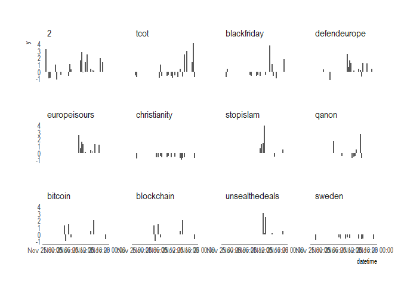

<!-- README.md is generated from README.Rmd. Please edit that file -->
[](https://travis-ci.org/davidski/hatetracker)

This is an R interface to the SPLC hatetracker.io project.

The data goes back to August 2016.

Installation
------------

`devtools::install_github("davidski/hatetracker")`

Thanks
------

This is an unofficial interface to the hatetracker API. Please be kind to the API and consdier donating to the critically important work the SPLC carries out.

``` r
## basic example code
library(hatetracker)
library(tidyverse)
#> -- Attaching packages --------------------------------------------------------------------------------- tidyverse 1.2.1 --
#> v ggplot2 2.2.1.9000     v purrr   0.2.4     
#> v tibble  1.3.4          v dplyr   0.7.4     
#> v tidyr   0.7.2          v stringr 1.2.0     
#> v readr   1.1.1          v forcats 0.2.0
#> -- Conflicts ------------------------------------------------------------------------------------ tidyverse_conflicts() --
#> x dplyr::filter() masks stats::filter()
#> x dplyr::lag()    masks stats::lag()
library(extrafont)
#> Registering fonts with R
dat <- get_hatetracker_activity("2017-11-25")
dat
#> # A tibble: 12 x 3
#>             title total              timeline
#>  *          <chr> <dbl>                <list>
#>  1              2  22.3 <data.frame [48 x 2]>
#>  2           tcot  20.4 <data.frame [48 x 2]>
#>  3    blackfriday  12.6 <data.frame [48 x 2]>
#>  4   defendeurope  12.0 <data.frame [48 x 2]>
#>  5   europeisours   9.3 <data.frame [48 x 2]>
#>  6   christianity   9.0 <data.frame [48 x 2]>
#>  7      stopislam   8.2 <data.frame [48 x 2]>
#>  8          qanon   7.8 <data.frame [48 x 2]>
#>  9        bitcoin   7.3 <data.frame [48 x 2]>
#> 10     blockchain   7.3 <data.frame [48 x 2]>
#> 11 unsealthedeals   6.3 <data.frame [48 x 2]>
#> 12         sweden   6.2 <data.frame [48 x 2]>
```

``` r
dat %>% mutate(title = forcats::as_factor(title)) %>% 
  tidyr::unnest() %>% mutate(datetime = as.POSIXct(name, tz = "utc")) %>% 
  ggplot(., aes(x = datetime, y = y)) + geom_col() + 
  #facet_wrap(~title, ncol = 1, strip.position = "left") +
  facet_wrap(~title) +
  hrbrthemes::theme_ipsum(grid = "", axis = "x")
#> Warning: Removed 445 rows containing missing values (position_stack).
```



Code of Conduct
---------------

Please note that this project is released with a [Contributor Code of Conduct](CONDUCT.md). By participating in this project you agree to abide by its terms.
