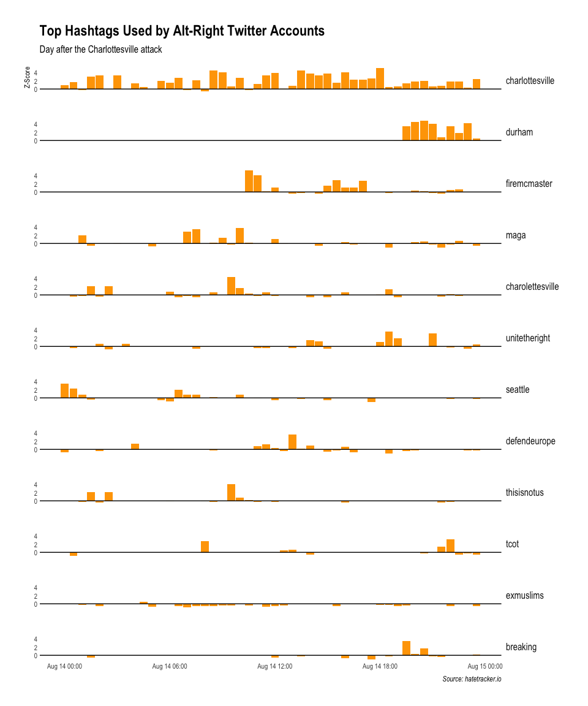
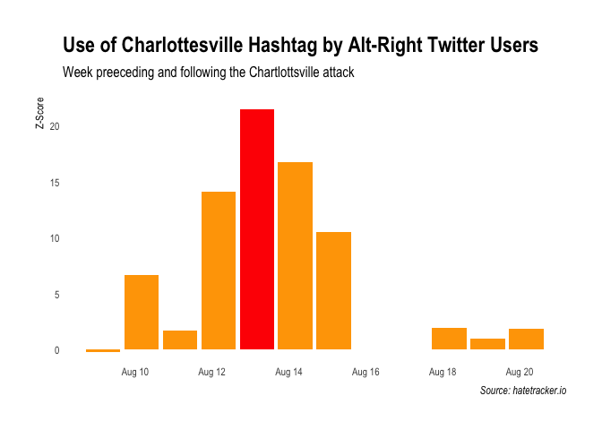

Hatetracker
================

<!-- README.md is generated from README.Rmd. Please edit that file -->
[](https://travis-ci.org/davidski/hatetracker) [](https://ci.appveyor.com/project/davidski/hatetracker) [](https://codecov.io/github/davidski/hatetracker?branch=master)

This is an R interface to the SPLC [hatetracker.io](https://hatetracker.io) project.

The data goes back to August 2016.

Installation
------------

Hatetracker is not on CRAN. Installation from GitHub is simplest via the `devtools` package:

`devtools::install_github("davidski/hatetracker")`

Thanks
------

-   This is an unofficial interface to the hatetracker API. Please be kind to the API and consider making a tax-deductible [donation](https://donate.splcenter.org/sslpage.aspx?pid=463) to the critically important work the SPLC carries out.
-   Cheers to @hrbrmstr for his countless packages. Darksky and friends were the motivators my creating this interface with a valuable web service.

Usage
-----

Load the `hatetracker` library and some supporting tooling.

``` r
library(hatetracker)
library(tidyverse)
library(extrafont)
```

Fetch the trending hashtags used in the alt-right community for a specific day. The data is returned as a nested dataframe for each trending tag, including the total number of times menti. The nested time frame includes a z-score normalized trend for the number of mentions at 30 minute intervals throughout the requested date range.

``` r
charlottesville <- as.Date("2017-08-13")
dat <- get_hatetracker_activity(charlottesville + 1)
dat
#> # A tibble: 12 x 3
#>               title total              timeline
#>  *            <chr> <dbl>                <list>
#>  1  charlottesville  92.7 <data.frame [48 x 2]>
#>  2           durham  28.0 <data.frame [48 x 2]>
#>  3     firemcmaster  23.7 <data.frame [48 x 2]>
#>  4             maga  22.3 <data.frame [48 x 2]>
#>  5 charolettesville  20.5 <data.frame [48 x 2]>
#>  6    unitetheright  19.3 <data.frame [48 x 2]>
#>  7          seattle  15.7 <data.frame [48 x 2]>
#>  8     defendeurope  15.0 <data.frame [48 x 2]>
#>  9      thisisnotus  12.0 <data.frame [48 x 2]>
#> 10             tcot  11.6 <data.frame [48 x 2]>
#> 11        exmuslims  11.3 <data.frame [48 x 2]>
#> 12         breaking   9.9 <data.frame [48 x 2]>
```

Basic plotting of the activity.

``` r
dat %>% mutate(title = forcats::as_factor(title)) %>% 
  tidyr::unnest() %>% 
  ggplot(., aes(x = date, y = z_score)) + geom_col(fill = "orange") + 
  geom_hline(yintercept = 0) +
  #facet_wrap(~title, ncol = 1, strip.position = "left") +
  facet_grid(title ~ .) +
  hrbrthemes::theme_ipsum(grid = "") + 
  theme(strip.text.y = element_text(size = 12, angle = 0, hjust = 0)) +
  labs(title = "Top Hashtags Used by Alt-Right Twitter Accounts", 
       subtitle = "Day after the Charlottesville attack",
       caption = "Source: hatetracker.io",
       y = "Z-Score", x = NULL)
#> Warning: Removed 319 rows containing missing values (position_stack).
```



We can also look at historical mentions of specific tags. In this case, the `#charlottesville` tag.

``` r
historical <- get_hatetracker_activity2(charlottesville  - 7, charlottesville + 7)
char_hashtag <- historical[[1, "timeline"]]
char_hashtag
#> # A tibble: 10 x 2
#>                   date z_score
#>                 <dttm>   <dbl>
#>  1 2017-08-09 04:00:00   -0.18
#>  2 2017-08-10 04:00:00    6.68
#>  3 2017-08-11 04:00:00    1.74
#>  4 2017-08-12 04:00:00   14.10
#>  5 2017-08-13 04:00:00   21.50
#>  6 2017-08-14 04:00:00   16.80
#>  7 2017-08-15 04:00:00   10.48
#>  8 2017-08-18 04:00:00    1.92
#>  9 2017-08-19 04:00:00    0.95
#> 10 2017-08-20 04:00:00    1.87
```

``` r
char_hashtag$attack <- as.Date(char_hashtag$date) == charlottesville
ggplot(char_hashtag, aes(date, z_score)) + 
  geom_col(aes(fill = attack)) +
  scale_fill_manual(values = c("orange", "red"), guide = FALSE) + 
  labs(x = NULL, y = "Z-Score", 
       title = "Use of Charlottesville Hashtag by Alt-Right Twitter Users", 
       subtitle = "Week preeceding and following the Chartlottsville attack",
       caption = "Source: hatetracker.io") +
  hrbrthemes::theme_ipsum(grid = "")
```



Code of Conduct
---------------

Please note that this project is released with a [Contributor Code of Conduct](CONDUCT.md). By participating in this project you agree to abide by its terms.

License
-------

The [MIT License](LICENSE) applies.
